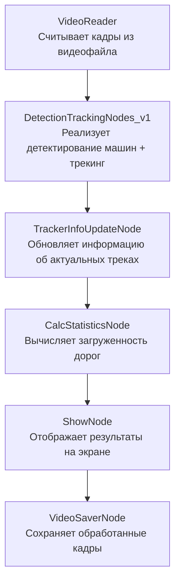
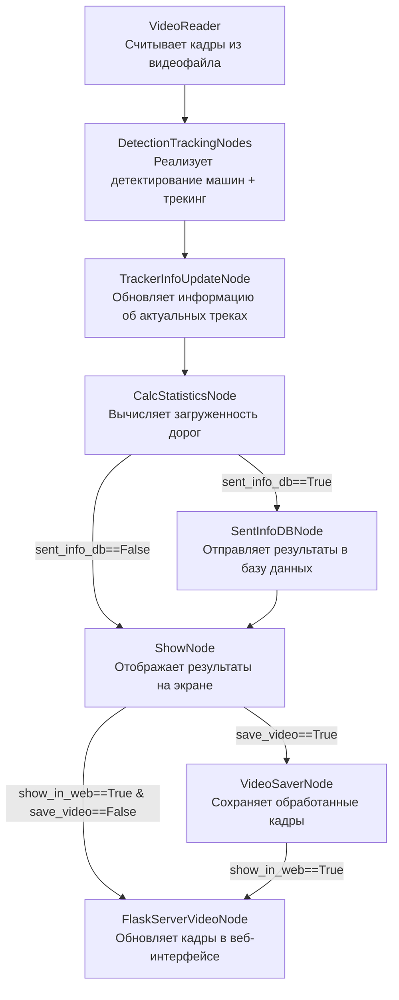

# Анализ трафика на круговом движении

Данная программа осуществляет анализ входящего трафика на участке кругового движения. Алгоритм определяет загруженность примыкающих дорог и выводит интерактивную статистику.

Базовый проект - [__ссылка на видео__](https://youtu.be/u9EtqHz4Vqc)

Дополнительно выполнена реализация "легкой" версии проекта без сторонних ресурсов  в google colab с использованием - Multi-Object Tracking with Ultralytics YOLO (DetectionTrackingNodes_v1.py).

## Установка:
Необходима версия Python >= 3.10 (лучше 3.10.14)
```
pip install torch torchvision torchaudio --index-url https://download.pytorch.org/whl/cu118
pip install -r requirements.txt
```
## Работа с программой:
Перед запуском необходимо в файле __configs/app_config.yaml__ указать все желаемые параметры. Далее можно запускать код.

Классический запуск кода:
```
python main.py
```
Пример запуска в дебаг режиме (профилировщик):
```
python main.py hydra.job_logging.root.level=DEBUG
```
---

Оптимизированный код с помошью multiprocessing позволяет добиться более высокой скорости обработки (>30 fps). Для его запуска необходимо запустить терминальную команду:
```
python main_optimized.py 
```

Запуск кода в google colab:
```
main.ipynb 
```
Для тестирования работы проекта в репозитории уже имеется видео test_videos/test_video.mp4. 


---
## Примеры работы кода (для google colab):

__Пример работы алгоритма c выводом статистики__: каждая машина отображается цветом, соответствующим дороге, с которой она прибыла к круговому движению + выводится значение числа видимых машин + значения интенсивности входного потока (число машин в минуту с каждой входящей дороги). <br/>Отображается таким образом при выборе в конфигурации show_node.show_info_statistics=True 


## Реализация кода:

Каждый кадр последовательно проходит через ноды, и в атрибуты этого объекта добавляется информация.





